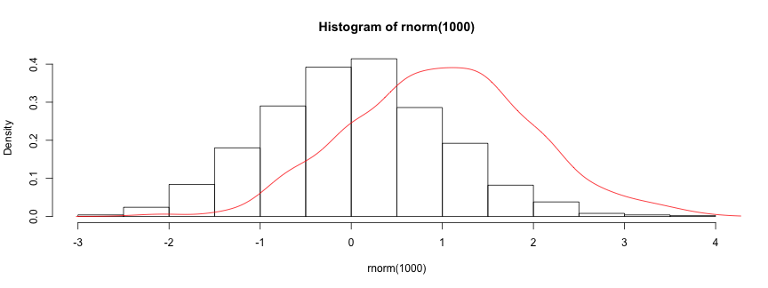

---
title       : Demo of my Shiny App
subtitle    : A Single Plot for Multi-variables comparasion
author      : yi tang 
job         : Statistician
framework   : io2012        # {io2012, html5slides, shower, dzslides, ...}
highlighter : highlight.js  # {highlight.js, prettify, highlight}
hitheme     : tomorrow      # 
widgets     : []            # {mathjax, quiz, bootstrap}
mode        : selfcontained # {standalone, draft}
knit        : slidify::knit2slides

--- 
## Density Estimation
The main idea of this app is to compare common variables among two dataset. The method used is call **Kernal Density Estimation**, compuated by `density()` function. One example is as follows. 


```r
hist(rnorm(1000), prob=T)
lines(density(rnorm(1000, 1)), col = 2)
```

 

--- .class #id 

## Input 
Click `Choose File` to upload csv data file, it will open an new window to let user nevigate the file location. 

The blue bar underneed shows the progress. For a large data file, the browser may freeze, please be paithence. 

The data file must meet following critirials: 
* standard csv file, i.e. with header and ',' deliminated. 
* two data files should have at least one common columns to compare with.
* the columns to be compared should be numeric values, i.e. 2, 10.4 etc. 
 

--- .class #id 
## Vairblaes to Compare 

After two data files are uploaded, a new block naemd `Choose columns` will come up. 

It shows the variables to compare among the two dataset. Only common variables among two dataset are aviavbale. 

Choose variables to compare by clicking the vairable name. You can compare multiple varialbe at once. 

Pressure `Compare to produce the density comparing plots. 

You can repeat `Choose columns` and `Compare` many times. 

--- 
 
## Plots
A graphical panel is produced on the right. 

+ Title shows the two file names just been uploaded, with 'v.s' in between.
+ The x-axis shows the value of variables, y-axis is the density calcualted by `density()`.
+ Legend demonstrates the colour used in the plot. Red is for File1 and blue for File2.
+ The sub-caption of each plot shows which variable it refers to.

In this setting, it is easy to compare one vairblae between two dataset at a time. 

Click `Download plot` to save the plots as a png file. It will be saved in Download folder, named image.png. 

 
